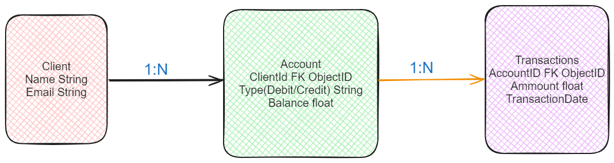

# 📚 Stori Software Enginee - Technical Challenge

Welcome to the Stori Software Enginee - Technical Challenge project! This README provides an overview of the project architecture, database model, execution requirements, assets, and scripts. The objective is create a seamless Go-based AWS Lambda application with MongoDB, S3, and SES integration. Let's dive in! ✨

---

## 🏗️ Proposed Architecture
Here's the high-level architecture for our project:


- **AWS Lambda with Go**: I use Go in Lambda for its high performance, concurrency, and efficiency in serverless environments. Go's static binaries and small footprint make it ideal for Lambda functions.
- **S3 Bucket**: This is where I store the CSV file to be processed. An S3 trigger invokes the Lambda function when a new file is added. Using S3 for event-driven Lambda functions is advantageous because it's scalable, reliable, and easy to integrate.
- **AWS SES**: For sending emails, I propose using AWS Simple Email Service (SES). SES is cost-effective, scalable, and integrates well with other AWS services, making it a great choice for email notifications.
- **MongoDB**: I chose MongoDB for persisting clients, their accounts, and transactions. MongoDB's flexible schema and horizontal scalability are perfect for a dynamic project like this.
- **IAM Roles**: I created IAM roles and policies to allow Lambda to listen to S3 events and consume AWS SES services. IAM provides fine-grained access control, enhancing security.

---

## 🗃️ Proposed Database Model
Below is the database model we use in this project:



- **Collection Client**: Stores a simple record of a client with their name and email.
- **Collection Account**: Stores the different accounts a client might have (debit or credit), along with their balance.
- **Collection Transactions**: Stores all transactions made by the accounts, including date and amount.

You can view the models in the `stori-app/function/models` directory.

---

## 🛠️ Execution Requirements
Before running the project, ensure you have the following installed:

- GO version 1.21
- Docker
- AWS CLI
- AWS Credentials
- MongoDB@Latest

Additionally, rename the `.env.example` file and replace the values with those from your environment. Note that the `SENDER_EMAIL` environment variable must contain an email that has been verified with AWS SES.

Steps

1. Execute the script `run.sh`, to build and create a docker container with the lambda and the mongodb instance in your local environment
2. To execute the lambda in your local enviroment, send a HTTP request, you can choose to options
  * In the assest folder you can execute the `test.http` file
  * From Postman or another http client, you can copy the content of `test.http` and send the request

## 📝 Scripts
Before running any scripts, ensure they have the proper permissions with the following command:

```bash
chmod +x ./scripts/deploy
```

---

## 📂 Assets
There's a folder with assets that include the following:

- **Email Template**: The email template used for AWS SES.
- **Test CSV Files**: Sample CSV files for testing.
- **HTTP File**: A file with an `.http` extension to simulate an S3 event and invoke the Lambda function locally.

---

## 📖 References
Here are some helpful links to understand the integration of different components:

- [S3 with Lambda](https://docs.aws.amazon.com/lambda/latest/dg/with-s3-example.html)
- [Lambda Runtime Interface Emulator](https://docs.aws.amazon.com/lambda/latest/dg/go-image.html#go-alt-test)
- [AWS Lambda Docker Images](https://docs.aws.amazon.com/lambda/latest/dg/go-image.html#go-image-provided)

---

